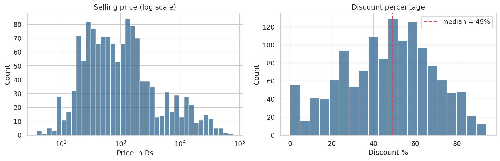
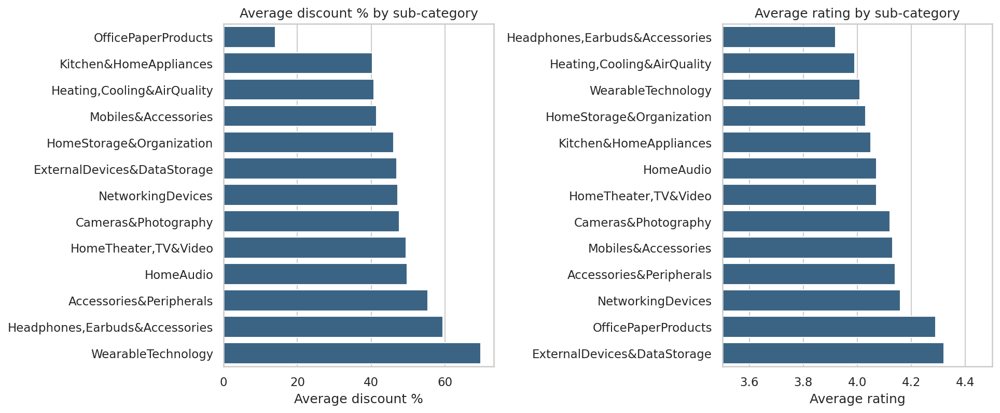
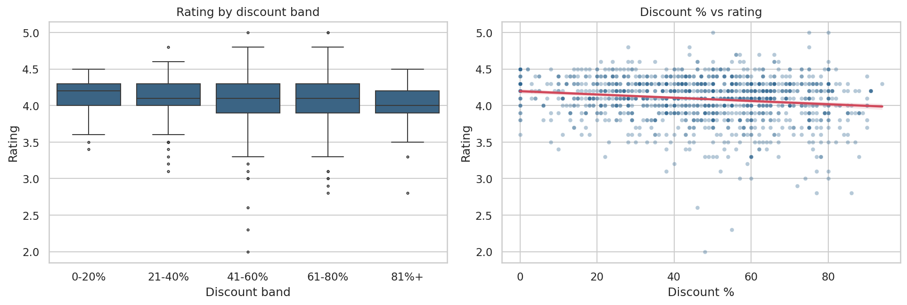
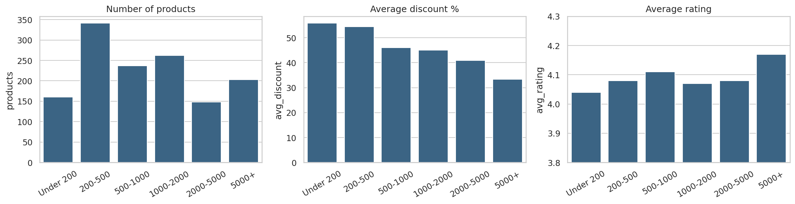
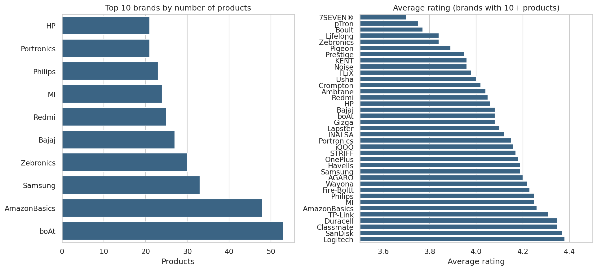
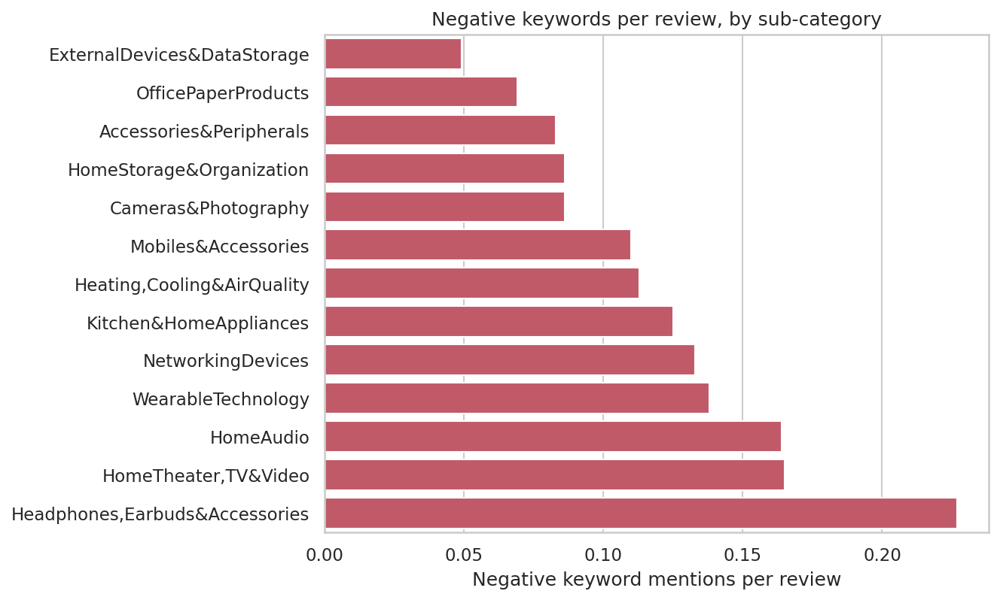

# Amazon India Product Analysis: Pricing, Discounts and Ratings

An end-to-end data analysis project on 1,465 Amazon India product listings (1,351 unique products after cleaning). I looked at how discounts, prices and brands relate to customer ratings and what customers complain about in their reviews.

Tools used: Python (Pandas, NumPy, Matplotlib, Seaborn), SQL (SQLite), MS Excel, Jupyter Notebook, GitHub. The cleaned data is also prepared for Power BI / Tableau.

 Questions I tried to answer
1. How are prices and discounts distributed?
2. Which categories give the biggest discounts, and which are rated best?
3. Does a bigger discount mean a lower rating?
4. Do price bands make a difference to rating?
5. Which brands are best rated? Which products are best once the number of ratings is taken into account?
6. Which products look overpromised (huge discount, low rating)?
7. In which sub-categories do customers complain the most?

Dataset
 Amazon India product listings with category, actual price, discounted price, discount %, rating, rating count and up to 8 customer reviews per product (1,465 rows, 16 columns).

 Data cleaning (notebook 01)
- Price, discount, rating and rating count were stored as text (₹ sign, commas, % sign), so I converted them to numbers.
- One product had `|` as its rating. I set it to missing instead of guessing.
- 114 rows repeated an existing `product_id` (same product scraped twice with tiny differences). I kept one row per product, the one with the highest rating count. 1,351 products remained.
- Split the `category` column into main category, sub category and last-level category.
- Created `brand` (first word of the product name, with spelling fixed), `price_band`, `discount_band`, `amount_saved`.
- Created simple positive / negative keyword counts per review from the review text.
- Checked that discounted price is never above actual price and that the discount % matches the prices. Both checks passed.
- I did not fill the 3 missing rating / rating count values, because made-up numbers would change the results.

 Key findings
- Discounts are deep.** The median discount is 49%, and 31% of products have a discount of 60% or more. Cheaper products get bigger percentage discounts.
- Higher discount, slightly lower rating.** Average rating falls from 4.17 (0-20% discount) to 3.97 (81%+ discount). The correlation is weak (Spearman -0.15), so discount alone does not explain ratings.
- Headphones/earbuds and wearables are the weak spot.** They have some of the highest discounts (59.5% and 69.7%), the headphones have the lowest average rating (3.92) and the most complaint words in reviews, and 9 of the 22 "overpromised" products come from these two sub-categories.
- Storage, cables and accessories from established brands are the most consistent.** Logitech (4.38), SanDisk (4.37) and Duracell / Classmate (4.35) lead among brands with 10+ products. pTron (3.75) and Boult (3.77), both with 77-80% average discounts, are near the bottom.
- Electronics gets about 60% of all ratings** in the data (14.2 million of 23.8 million).
- Weighted rating (same idea as IMDb Top 250) removes products with a perfect rating but only a handful of ratings, and gives a fairer top 10.

### Charts
| | |
|---|---|
|  |  |
|  |  |
|  |  |

More charts are in the `images/` folder and in the notebook.

## SQL
`sql/queries.sql` has 11 queries on the cleaned data (loaded into SQLite): aggregations with `GROUP BY` / `HAVING`, `CASE WHEN` bands, CTEs, a self-join against sub-category averages, window functions (`ROW_NUMBER() OVER (PARTITION BY ...)`) and the weighted rating formula. Results are saved in `reports/sql_results/`.

## Excel
`reports/Amazon_Analysis_Summary.xlsx` has the clean data plus summary sheets (category, sub-category, discount bands, price bands) built with `COUNTIFS`, `AVERAGEIFS` and `SUMIFS` formulas, so they update if the data changes.

## Power BI / Tableau
`data/processed/amazon_products_clean.csv` is ready to load. `docs/dashboard_guide.md` lists suggested visuals and DAX measures.

## Project structure
```
amazon-sales-analysis/
├── data/
│   ├── raw/amazon.csv
│   └── processed/amazon_products_clean.csv
├── notebooks/
│   ├── 01_data_cleaning.ipynb
│   └── 02_exploratory_analysis.ipynb
├── sql/queries.sql
├── src/
│   ├── run_sql.py
│   └── make_excel_report.py
├── reports/            summary tables, SQL results, Excel workbook
├── images/             charts
├── docs/dashboard_guide.md
├── requirements.txt
└── README.md
```

## How to run
```bash
pip install -r requirements.txt

# 1. run notebooks in order
jupyter notebook notebooks/01_data_cleaning.ipynb
jupyter notebook notebooks/02_exploratory_analysis.ipynb

# 2. run the SQL queries
python src/run_sql.py

# 3. rebuild the Excel report (optional)
python src/make_excel_report.py
```
Run the notebooks from inside the `notebooks/` folder (they use relative paths).

## Limitations
- `rating_count` is the number of ratings, not sales. I only use it as a rough measure of popularity.
- Only up to 8 reviews per product are in the file, and the review analysis is simple keyword counting, not proper sentiment analysis.
- Brand is the first word of the product name, so a few brands are not perfectly grouped (for example Mi and Redmi are both Xiaomi).
- The data is a single snapshot with no dates, so I could not study trends over time.
- Correlation is not causation.

## What I learned
Cleaning took more effort than the analysis: almost every numeric column was text, and duplicate products would have inflated the category numbers. I also learned why averages need a minimum number of products or ratings behind them before they mean anything.

## Author
Amit Negi
